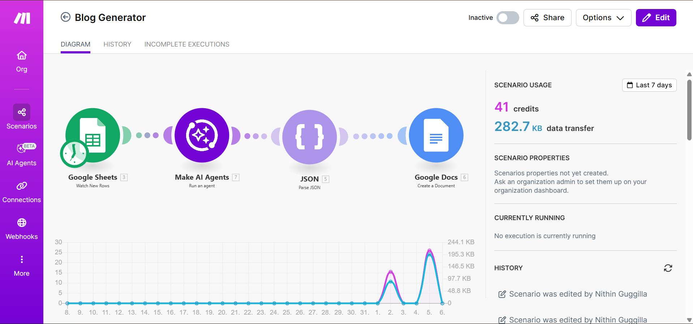

# Automated Blog SEO Generator using AI

## Overview
This workflow generates SEO-optimized blog content using an AI agent based on a given keyword or topic.

## Tools Used
- Make.com
- OpenAI
- Google Docs / Notion

## Workflow Steps
1. User submits blog topic or keyword
2. AI generates SEO-friendly content
3. Headings, meta description, and keywords are created
4. Content is saved for review

## Screenshots

## Business Use Case
Helps marketers and content teams generate optimized blog drafts faster.

## Notes
Prompts are optimized for SEO best practices.
