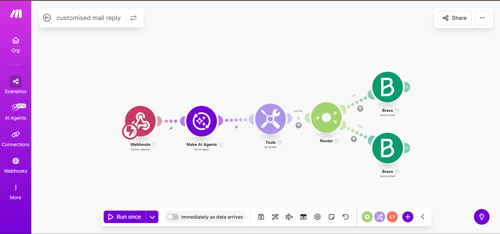
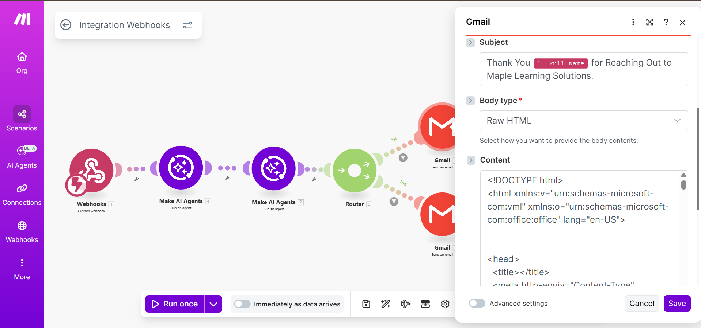

# Customized AI Email Reply to Leads

## Overview
This automation uses an AI agent to generate personalized email replies to incoming leads based on their message content and intent.

## Tools Used
- Make.com
- OpenAI
- Email (Gmail / SMTP / Outlook)
- Webhook / Form Trigger

## Workflow Steps
1. Lead submits an inquiry
2. Data is sent to AI agent for intent analysis
3. AI generates a customized email reply
4. Email is automatically sent to the lead

## Screenshots

## Business Use Case
Improves lead response time and increases conversion by sending context-aware replies automatically.

## Notes
API keys and email credentials are hidden for security.

