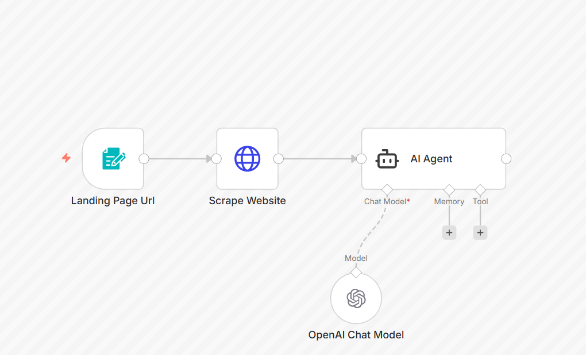

# Landing Page Analysis using AI

## Overview
This automation analyzes landing page content using AI and provides optimization suggestions.

## Tools Used
- Make.com
- OpenAI
- Web Scraper / URL Fetch

## Workflow Steps
1. Landing page URL is submitted
2. Page content is extracted
3. AI analyzes structure, copy, and CTA
4. Optimization tips are generated

## Screenshots

## Business Use Case
Helps marketers improve conversion rates using AI insights.

## Notes
Analysis is content-based and non-invasive.
