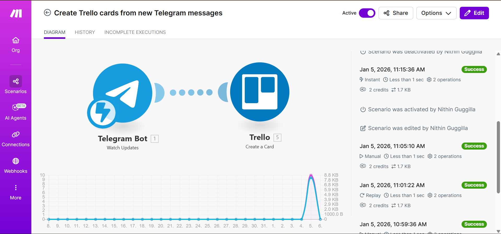

# Trello Kanban Updates via Telegram Bot

## Overview
This n8n workflow updates a Trello Kanban board based on Telegram bot commands.

## Tools Used
- n8n
- Telegram Bot API
- Trello API

## Workflow Steps
1. User sends command via Telegram
2. Command is parsed
3. Trello card is created or updated
4. Confirmation message is sent back

## Screenshots

## Business Use Case
Enables quick task updates without opening Trello.

## Notes
Bot tokens and API keys are removed.
