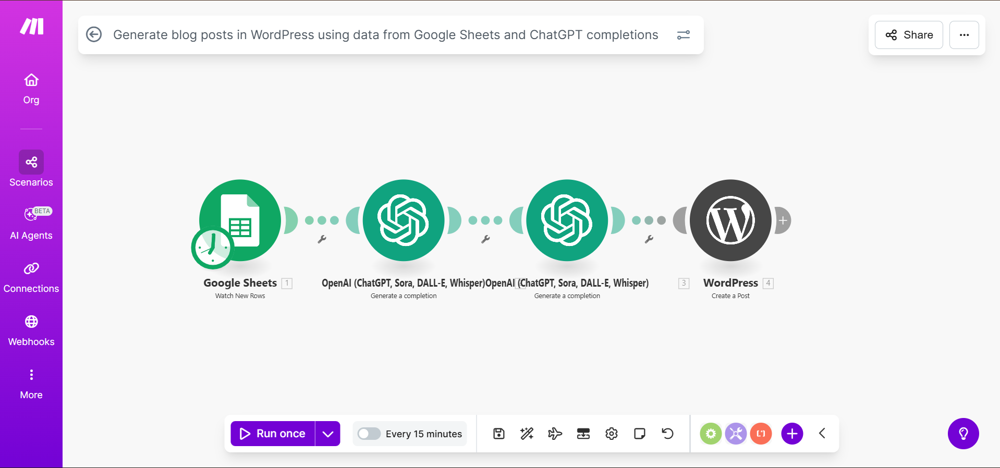

# AI Blog Generation and WordPress Draft

## Overview
This automation generates a blog using AI and automatically creates a draft page in WordPress.

## Tools Used
- Make.com
- OpenAI
- WordPress REST API

## Workflow Steps
1. Blog topic is provided
2. AI generates structured blog content
3. Content is formatted
4. Draft page is created in WordPress

## Screenshots

## Business Use Case
Reduces manual effort in content publishing workflows.

## Notes
WordPress authentication tokens are secured.

